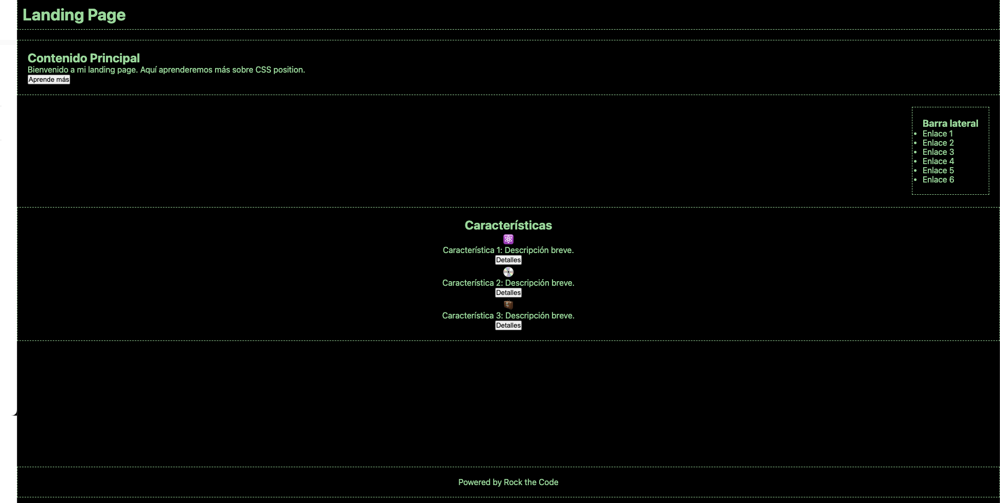

# crear una Landing Page utilizando CSS position.

Además de position puedes utilizar colores, padding, margin, tamaños y cualquier propiedad de estilos.
Las únicas que no puedes utilizar son las propiedades **display**.

El resultado final se tiene que asemejar al siguiente ejemplo:

La etiqueta **`header**` debe estar fija durante la navegación en la parte superior, y mediante un color de fondo hacer que los elementos durante el scroll pasen "por detrás".

La etiqueta **`footer`** debe de estar "pegada" al fondo de la aplicación.

La etiqueta **`sidebar`** debe de estar colocada a la derecha del contenido justo debajo de **header**.

El resto de elementos deberán de respetar su colocación tal y como se refleja en la imagen de ejemplo.

La elección de colores, fuentes y tamaños es libre, la única condición es utilizar las propiedades correctas de position para la colocación de elementos.

Además, sientete libre de cambiar la temática y hacer algo similar con tus gustos personales.
